# Cơ chế Điều khiển Drone trong EGO-Swarm

## 📋 Tổng quan

EGO-Swarm điều khiển drone thông qua một chuỗi các bước từ **Planning** → **Trajectory** → **Control Commands** → **Actuators**.

---

## 🔄 Luồng Điều khiển Hiện tại (Simulator Cũ)

### Sơ đồ Tổng quan

```mermaid
sequenceDiagram
    participant USER as 👤 User
    participant GOAL as 🎯 Goal Topic
    participant FSM as 🧠 ego_replan_fsm
    participant PLANNER as 📐 Path Planner
    participant OPT as ✨ B-spline Optimizer
    participant TRAJ as 📊 traj_server
    participant SIM as 🎮 Simulator

    USER->>GOAL: Publish /goal<br/>(PoseStamped)
    GOAL->>FSM: Receive goal
    FSM->>FSM: State: WAIT_TARGET → GEN_NEW_TRAJ
    
    FSM->>PLANNER: Request path
    PLANNER->>PLANNER: A* / JPS path search
    PLANNER->>OPT: Raw path
    
    OPT->>OPT: B-spline optimization<br/>Collision check<br/>Smoothing
    OPT->>FSM: Optimized trajectory
    
    FSM->>FSM: State: GEN_NEW_TRAJ → EXEC_TRAJ
    FSM->>TRAJ: Publish B-spline<br/>/planning/bspline
    
    TRAJ->>TRAJ: Sample trajectory<br/>at fixed rate (30Hz)
    TRAJ->>SIM: Publish PositionCommand<br/>/planning/pos_cmd
    
    Note over SIM: OLD: poscmd_2_odom<br/>directly converts to odom
    
    SIM->>SIM: Update position<br/>Perfect tracking
```

### Chi tiết từng bước:

#### 1. **User Set Goal**
```bash
# Via RViz (2D Nav Goal) hoặc
ros2 topic pub --once /goal geometry_msgs/PoseStamped \
  "{header: {frame_id: 'world'}, \
    pose: {position: {x: 5.0, y: 3.0, z: 1.5}}}"
```

#### 2. **Planning FSM State Machine**

File: `ego_replan_fsm.cpp`

```cpp
void EGOReplanFSM::execFSMCallback() {
    switch(exec_state_) {
        case WAIT_TARGET:
            // Chờ goal từ user
            if (have_target_) {
                changeFSMExecState(GEN_NEW_TRAJ, "FSM");
            }
            break;
            
        case GEN_NEW_TRAJ:
            // Generate trajectory
            callPlanningService();  // Gọi planner
            if (planning_success) {
                changeFSMExecState(EXEC_TRAJ, "FSM");
            }
            break;
            
        case EXEC_TRAJ:
            // Execute trajectory
            publishTrajectory();
            
            // Check replan conditions
            if (collision_detected || timeout) {
                changeFSMExecState(REPLAN_TRAJ, "FSM");
            }
            break;
    }
}
```

#### 3. **Path Planning**

File: `path_searching/kinodynamic_astar.cpp`

```cpp
// A* hoặc JPS tìm path từ start → goal
// Tránh obstacles từ occupancy grid map
// Output: Waypoints (x, y, z, vx, vy, vz)
```

#### 4. **B-spline Optimization**

File: `bspline_opt/bspline_optimizer.cpp`

```cpp
// Input: Raw path từ A*
// Optimize:
// 1. Smoothness (minimize jerk)
// 2. Collision avoidance
// 3. Dynamic feasibility (velocity, acceleration limits)
// 4. Swarm collision avoidance (với other drones)
// Output: B-spline trajectory
```

#### 5. **Trajectory Server**

File: `traj_server.cpp`

```cpp
void TrajServer::bsplineCallback(const traj_utils::Bspline& msg) {
    // Nhận B-spline từ planner
    traj_ = UniformBspline(msg);
    
    // Start publishing timer (30 Hz)
    cmd_timer_.start();
}

void TrajServer::cmdCallback() {
    // Sample trajectory tại thời điểm hiện tại
    double t = (ros::Time::now() - start_time_).toSec();
    
    Eigen::Vector3d pos = traj_.evaluateDeBoor(t);
    Eigen::Vector3d vel = traj_.evaluateDeBoorVel(t);
    Eigen::Vector3d acc = traj_.evaluateDeBoorAcc(t);
    
    // Tạo PositionCommand message
    quadrotor_msgs::PositionCommand cmd;
    cmd.position.x = pos(0);
    cmd.position.y = pos(1);
    cmd.position.z = pos(2);
    cmd.velocity.x = vel(0);
    cmd.velocity.y = vel(1);
    cmd.velocity.z = vel(2);
    cmd.acceleration.x = acc(0);
    cmd.acceleration.y = acc(1);
    cmd.acceleration.z = acc(2);
    
    // Publish
    pos_cmd_pub_.publish(cmd);  // Topic: /planning/pos_cmd
}
```

#### 6. **Simulator Cũ (poscmd_2_odom)**

File: `poscmd_2_odom/poscmd_2_odom.cpp`

```cpp
void PosCmd2Odom::cmdCallback(const quadrotor_msgs::PositionCommand& cmd) {
    // SIMULATOR GIẢ LẬP - Perfect tracking!
    
    // Directly convert command to odometry
    nav_msgs::Odometry odom;
    odom.pose.pose.position = cmd.position;
    odom.twist.twist.linear = cmd.velocity;
    
    // Publish as if drone reached exactly that position
    odom_pub_.publish(odom);
    
    // → Không có dynamics thực, không có PID control!
}
```

---

## 🆕 Luồng Điều khiển Mới (với Gazebo X500)

### Sơ đồ Chi tiết

```mermaid
sequenceDiagram
    participant USER as 👤 User
    participant FSM as 🧠 ego_replan_fsm
    participant TRAJ as 📊 traj_server
    participant BRIDGE as 🌉 x500_cmd_bridge
    participant PX4 as ⚙️ PX4 SITL
    participant X500 as 🚁 X500 Gazebo
    participant OV as 👁️ OpenVINS
    participant OCONV as 🔄 odom_converter

    USER->>FSM: /goal
    
    Note over FSM: Planning<br/>(A* + B-spline)
    
    FSM->>TRAJ: /planning/bspline
    
    loop Every 30Hz
        TRAJ->>TRAJ: Sample trajectory<br/>pos, vel, acc
        TRAJ->>BRIDGE: /planning/pos_cmd<br/>PositionCommand
        
        Note over BRIDGE: Convert EGO format<br/>→ PX4 format<br/>ENU → NED
        
        BRIDGE->>PX4: /fmu/in/trajectory_setpoint<br/>TrajectorySetpoint
        BRIDGE->>PX4: /fmu/in/offboard_control_mode<br/>OffboardControlMode
        
        PX4->>PX4: Position Controller<br/>Velocity Controller<br/>Attitude Controller
        
        PX4->>X500: Motor commands<br/>(PWM)
        
        X500->>X500: Physics simulation<br/>Aerodynamics<br/>Movement
        
        X500->>OV: Camera + IMU data
        OV->>OV: VIO estimation
        OV->>OCONV: /ov_msckf/odometry_imu
        OCONV->>FSM: odom_world
        
        Note over FSM: Close the loop!<br/>Check if on trajectory
    end
```



### Chi tiết Implementation:

#### 1. **PositionCommand Message Format**

```cpp
// quadrotor_msgs/msg/PositionCommand.msg
std_msgs/Header header

geometry_msgs/Point position      // Target position (x, y, z)
geometry_msgs/Vector3 velocity    // Target velocity (vx, vy, vz)
geometry_msgs/Vector3 acceleration // Target acceleration (ax, ay, az)

float64 yaw                       // Target yaw angle
float64 yaw_dot                   // Yaw rate

uint8 trajectory_flag             // Execution mode
uint8 trajectory_id               // Trajectory ID
```

#### 2. **x500_cmd_bridge Implementation**

File: `x500_bridge/src/x500_cmd_bridge.cpp`

```cpp
#include <rclcpp/rclcpp.hpp>
#include <quadrotor_msgs/msg/position_command.hpp>
#include <px4_msgs/msg/offboard_control_mode.hpp>
#include <px4_msgs/msg/trajectory_setpoint.hpp>
#include <px4_msgs/msg/vehicle_command.hpp>

class X500CmdBridge : public rclcpp::Node
{
public:
    X500CmdBridge() : Node("x500_cmd_bridge")
    {
        // Subscribe to EGO-Swarm command
        cmd_sub_ = this->create_subscription<quadrotor_msgs::msg::PositionCommand>(
            "planning/pos_cmd", 10,
            std::bind(&X500CmdBridge::cmdCallback, this, std::placeholders::_1));
        
        // Publishers to PX4
        offboard_mode_pub_ = this->create_publisher<px4_msgs::msg::OffboardControlMode>(
            "/fmu/in/offboard_control_mode", 10);
        
        trajectory_pub_ = this->create_publisher<px4_msgs::msg::TrajectorySetpoint>(
            "/fmu/in/trajectory_setpoint", 10);
        
        vehicle_cmd_pub_ = this->create_publisher<px4_msgs::msg::VehicleCommand>(
            "/fmu/in/vehicle_command", 10);
        
        // Timer to maintain offboard mode
        timer_ = this->create_wall_timer(
            std::chrono::milliseconds(100),
            std::bind(&X500CmdBridge::publishOffboardMode, this));
        
        // Arm and switch to offboard after 2 seconds
        arm_timer_ = this->create_wall_timer(
            std::chrono::seconds(2),
            std::bind(&X500CmdBridge::armAndOffboard, this));
    }

private:
    void cmdCallback(const quadrotor_msgs::msg::PositionCommand::SharedPtr msg)
    {
        // Convert EGO-Swarm command to PX4 trajectory setpoint
        px4_msgs::msg::TrajectorySetpoint traj;
        
        // Position (ENU to NED conversion)
        // EGO-Swarm: X=East, Y=North, Z=Up
        // PX4: X=North, Y=East, Z=Down
        traj.position[0] = msg->position.y;   // North (Y_enu)
        traj.position[1] = msg->position.x;   // East (X_enu)
        traj.position[2] = -msg->position.z;  // Down (-Z_enu)
        
        // Velocity (ENU to NED)
        traj.velocity[0] = msg->velocity.y;   // North
        traj.velocity[1] = msg->velocity.x;   // East
        traj.velocity[2] = -msg->velocity.z;  // Down
        
        // Acceleration (ENU to NED)
        traj.acceleration[0] = msg->acceleration.y;
        traj.acceleration[1] = msg->acceleration.x;
        traj.acceleration[2] = -msg->acceleration.z;
        
        // Yaw (keep same, both are counter-clockwise from North/X)
        traj.yaw = msg->yaw;
        traj.yawspeed = msg->yaw_dot;
        
        // Timestamp
        traj.timestamp = this->now().nanoseconds() / 1000;
        
        // Publish
        trajectory_pub_->publish(traj);
        
        RCLCPP_DEBUG(this->get_logger(), 
            "Published trajectory: pos=[%.2f, %.2f, %.2f] vel=[%.2f, %.2f, %.2f]",
            traj.position[0], traj.position[1], traj.position[2],
            traj.velocity[0], traj.velocity[1], traj.velocity[2]);
    }
    
    void publishOffboardMode()
    {
        px4_msgs::msg::OffboardControlMode msg;
        msg.position = true;
        msg.velocity = true;
        msg.acceleration = true;
        msg.attitude = false;
        msg.body_rate = false;
        msg.timestamp = this->now().nanoseconds() / 1000;
        
        offboard_mode_pub_->publish(msg);
    }
    
    void armAndOffboard()
    {
        // Chỉ chạy 1 lần
        arm_timer_->cancel();
        
        // Send ARM command
        px4_msgs::msg::VehicleCommand arm_cmd;
        arm_cmd.command = 400; // MAV_CMD_COMPONENT_ARM_DISARM
        arm_cmd.param1 = 1.0;  // 1 = ARM
        arm_cmd.target_system = 1;
        arm_cmd.target_component = 1;
        arm_cmd.source_system = 1;
        arm_cmd.source_component = 1;
        arm_cmd.from_external = true;
        arm_cmd.timestamp = this->now().nanoseconds() / 1000;
        
        vehicle_cmd_pub_->publish(arm_cmd);
        
        RCLCPP_INFO(this->get_logger(), "Sent ARM command");
        
        // Send OFFBOARD mode command
        std::this_thread::sleep_for(std::chrono::milliseconds(100));
        
        px4_msgs::msg::VehicleCommand offboard_cmd;
        offboard_cmd.command = 176; // MAV_CMD_DO_SET_MODE
        offboard_cmd.param1 = 1.0;  // Main mode: CUSTOM
        offboard_cmd.param2 = 6.0;  // Sub mode: OFFBOARD
        offboard_cmd.target_system = 1;
        offboard_cmd.target_component = 1;
        offboard_cmd.source_system = 1;
        offboard_cmd.source_component = 1;
        offboard_cmd.from_external = true;
        offboard_cmd.timestamp = this->now().nanoseconds() / 1000;
        
        vehicle_cmd_pub_->publish(offboard_cmd);
        
        RCLCPP_INFO(this->get_logger(), "Sent OFFBOARD mode command");
    }

    rclcpp::Subscription<quadrotor_msgs::msg::PositionCommand>::SharedPtr cmd_sub_;
    rclcpp::Publisher<px4_msgs::msg::OffboardControlMode>::SharedPtr offboard_mode_pub_;
    rclcpp::Publisher<px4_msgs::msg::TrajectorySetpoint>::SharedPtr trajectory_pub_;
    rclcpp::Publisher<px4_msgs::msg::VehicleCommand>::SharedPtr vehicle_cmd_pub_;
    rclcpp::TimerBase::SharedPtr timer_;
    rclcpp::TimerBase::SharedPtr arm_timer_;
};

int main(int argc, char** argv)
{
    rclcpp::init(argc, argv);
    rclcpp::spin(std::make_shared<X500CmdBridge>());
    rclcpp::shutdown();
    return 0;
}
```

#### 3. **PX4 Internal Control**

Trong PX4 SITL:

```
TrajectorySetpoint
    ↓
Position Controller (mc_pos_control)
    ↓ (generates attitude setpoint)
Attitude Controller (mc_att_control)
    ↓ (generates rate setpoint)
Rate Controller (mc_rate_control)
    ↓ (generates motor commands)
Mixer
    ↓
Motors (PWM)
    ↓
Gazebo Physics
```

---

## 📊 So sánh Simulator Cũ vs Gazebo X500

### Simulator Cũ (poscmd_2_odom)


**Đặc điểm:**
- ✅ Đơn giản, dễ debug
- ✅ Perfect tracking (không bao giờ sai)
- ✗ Không có dynamics thực
- ✗ Không có delay
- ✗ Không test được controller
- ✗ Không realistic

### Gazebo X500 + PX4


**Đặc điểm:**
- ✅ Realistic dynamics
- ✅ Controller testing
- ✅ Có delay, noise
- ✅ Chuẩn bị cho hardware
- ✗ Phức tạp hơn
- ✗ Cần tune parameters

---

## 🔧 Topics và Messages

### EGO-Swarm → Bridge

**Topic:** `/drone_0_planning/pos_cmd` (cho drone 0)

**Type:** `quadrotor_msgs/PositionCommand`

**Rate:** 30 Hz (từ traj_server)

**Example:**
```yaml
header:
  stamp: {sec: 1234, nanosec: 567890}
  frame_id: "world"
position: {x: 5.0, y: 3.0, z: 1.5}
velocity: {x: 1.2, y: 0.8, z: 0.0}
acceleration: {x: 0.0, y: 0.0, z: 0.0}
yaw: 1.57
yaw_dot: 0.0
```

### Bridge → PX4

**Topic:** `/fmu/in/trajectory_setpoint`

**Type:** `px4_msgs/TrajectorySetpoint`

**Rate:** 30 Hz (same as input)

**Example:**
```yaml
timestamp: 1234567890
position: [3.0, 5.0, -1.5]  # NED: [N, E, D]
velocity: [0.8, 1.2, 0.0]   # NED
acceleration: [0.0, 0.0, 0.0]
yaw: 1.57
yawspeed: 0.0
```

### PX4 → X500 Gazebo

**Internal PX4:** Motor mixing

**Gazebo Plugin:** Receives motor commands, simulates physics

---

## ✅ Checklist để Drone Bay

### 1. **Topics đang publish đúng**
```bash
# Check EGO-Swarm planning command
ros2 topic hz /drone_0_planning/pos_cmd
# Expected: ~30 Hz

# Check PX4 receiving commands
ros2 topic hz /fmu/in/trajectory_setpoint
# Expected: ~30 Hz
```

### 2. **PX4 trong Offboard mode**
```bash
# Check vehicle status
ros2 topic echo /fmu/out/vehicle_status --field nav_state
# Should be: 14 (OFFBOARD mode)

# Check armed
ros2 topic echo /fmu/out/vehicle_status --field arming_state
# Should be: 2 (ARMED)
```

### 3. **Bridge hoạt động**
```bash
# Check bridge node
ros2 node info /x500_cmd_bridge

# Should subscribe to: /drone_0_planning/pos_cmd
# Should publish to: /fmu/in/trajectory_setpoint
```

### 4. **X500 đang di chuyển**
```bash
# Monitor position
ros2 topic echo /fmu/out/vehicle_odometry --field position

# Should see position changing
```

---

## 🐛 Troubleshooting

### Drone không bay

**Kiểm tra:**
```bash
# 1. Check if receiving commands
ros2 topic echo /drone_0_planning/pos_cmd --once

# 2. Check bridge converting
ros2 topic echo /fmu/in/trajectory_setpoint --once

# 3. Check PX4 mode
ros2 topic echo /fmu/out/vehicle_status

# 4. Check if armed
# nav_state should be 14 (OFFBOARD)
# arming_state should be 2 (ARMED)
```

**Fix:**
```bash
# Manually arm và set offboard
ros2 topic pub --once /fmu/in/vehicle_command px4_msgs/msg/VehicleCommand \
  "{command: 400, param1: 1.0}" # ARM

ros2 topic pub --once /fmu/in/vehicle_command px4_msgs/msg/VehicleCommand \
  "{command: 176, param1: 1.0, param2: 6.0}" # OFFBOARD
```

### Drone bay sai hướng

**Nguyên nhân:** Frame conversion sai (ENU vs NED)

**Fix:** Verify trong `x500_cmd_bridge.cpp`:
```cpp
// Đúng:
traj.position[0] = msg->position.y;   // North = Y_enu
traj.position[1] = msg->position.x;   // East = X_enu
traj.position[2] = -msg->position.z;  // Down = -Z_enu
```

### Drone rung lắc

**Nguyên nhân:** PX4 controller gains chưa tune

**Fix:** Tune PX4 parameters:
```bash
# In PX4 console
param set MPC_XY_P 0.95
param set MPC_Z_P 1.0
param save
```

---

## 📝 Summary

### Để EGO-Swarm điều khiển drone trong Gazebo:

1. **Planning**: EGO-Swarm tạo trajectory (B-spline)
2. **Sampling**: traj_server sample trajectory → PositionCommand (30Hz)
3. **Bridge**: x500_cmd_bridge convert ENU→NED, PositionCommand→TrajectorySetpoint
4. **PX4 Control**: PX4 position/attitude/rate controllers
5. **Gazebo**: Physics simulation + motor actuation
6. **Feedback**: OpenVINS VIO → odom_converter → EGO-Swarm

### Key Points:
- 🔄 **Closed-loop control** với real feedback
- 🎯 **30Hz command rate** cho smooth tracking
- 🌐 **Frame conversion** ENU ↔ NED
- ⚙️ **PX4 offboard mode** required
- 🚁 **Realistic dynamics** trong Gazebo

---

**File này giải thích:** Cơ chế điều khiển từ EGO-Swarm → Gazebo X500
