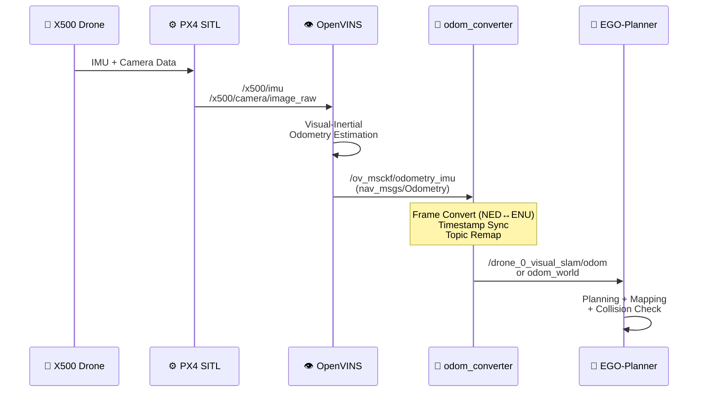
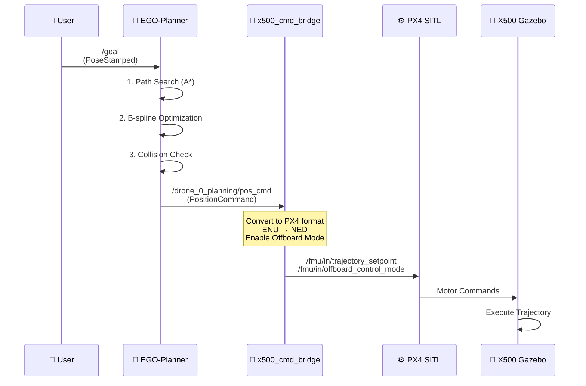
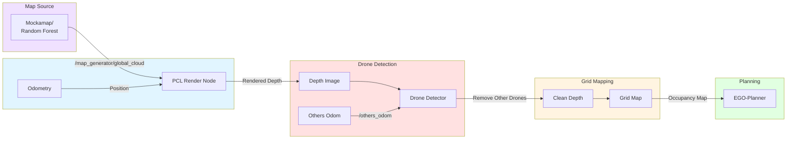
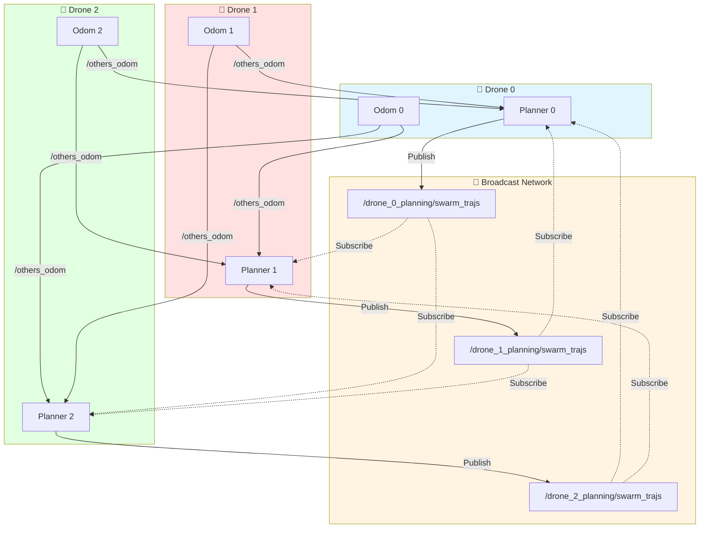
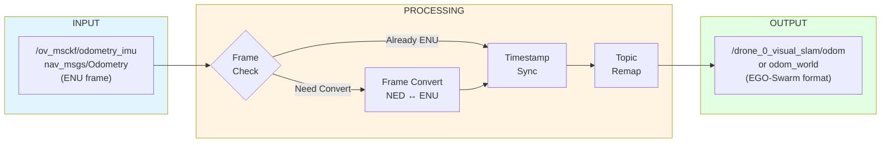
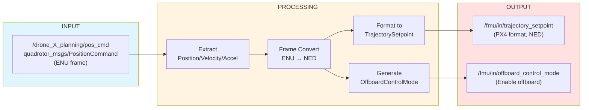
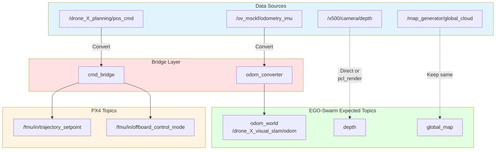
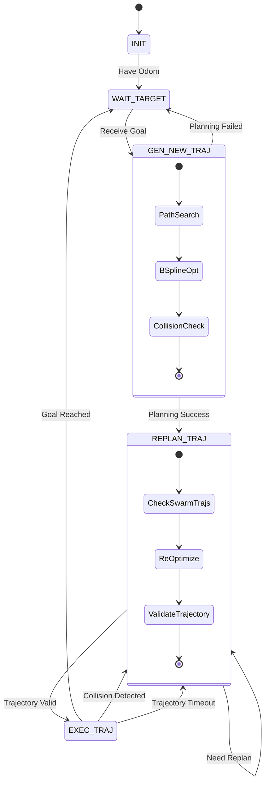
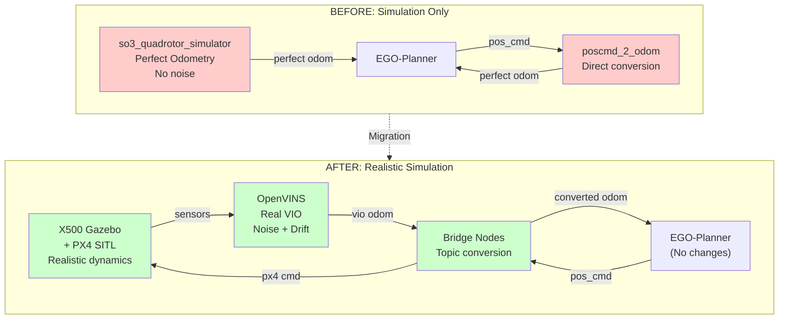

# Sơ đồ Mermaid - Tích hợp X500 + OpenVINS + EGO-Swarm

## 1. Sơ đồ Tổng quan Kiến trúc Hệ thống

```mermaid
graph TB
    subgraph Gazebo["🎮 GAZEBO SIMULATION"]
        X500["X500 Drone<br/>📡 IMU<br/>📷 Camera<br/>📏 Depth Cam<br/>🛰️ GPS"]
        PX4["PX4 SITL<br/>Flight Controller"]
        X500 -->|Sensor Data| PX4
    end

    subgraph OpenVINS["👁️ OPENVINS"]
        VIO["Visual-Inertial<br/>Odometry"]
        VIO_OUT["/ov_msckf/odometry_imu<br/>(nav_msgs/Odometry)"]
        VIO --> VIO_OUT
    end

    subgraph Bridge["🌉 BRIDGE NODES (Mới tạo)"]
        ODOM_CONV["odom_converter<br/>📊 Frame Convert<br/>⏱️ Time Sync"]
        CMD_BRIDGE["x500_cmd_bridge<br/>🎯 Command Convert<br/>📡 Offboard Mode"]
    end

    subgraph EgoSwarm["🚁 EGO-SWARM PLANNER"]
        subgraph Sensing["SENSING"]
            PCL["PCL Render"]
            DETECT["Drone Detector"]
        end
        
        subgraph Mapping["MAPPING"]
            GRIDMAP["Grid Map<br/>(Occupancy)"]
        end
        
        subgraph Planning["PLANNING"]
            FSM["ego_replan_fsm"]
            PATH["Path Search<br/>(A*, JPS)"]
            OPT["B-spline<br/>Optimization"]
            FSM --> PATH
            PATH --> OPT
        end
    end

    subgraph MapGen["🗺️ MAP GENERATOR"]
        MOCKA["Mockamap /<br/>Random Forest"]
    end

    %% Sensor Flow
    PX4 -->|/x500/camera/image<br/>/x500/imu| VIO

    %% Odometry Flow
    VIO_OUT --> ODOM_CONV
    ODOM_CONV -->|/drone_0_visual_slam/odom| Sensing
    ODOM_CONV -->|/drone_0_visual_slam/odom| Mapping
    ODOM_CONV -->|odom_world| Planning

    %% Map Flow
    MOCKA -->|/map_generator/global_cloud| PCL
    PCL -->|depth, point cloud| DETECT
    DETECT -->|clean_depth| GRIDMAP
    GRIDMAP -->|local_map| Planning

    %% Planning Flow
    OPT -->|/drone_0_planning/pos_cmd| CMD_BRIDGE
    CMD_BRIDGE -->|/fmu/in/trajectory_setpoint<br/>/fmu/in/offboard_control_mode| PX4

    %% Swarm Communication
    OPT -.->|/drone_X_planning/swarm_trajs<br/>(broadcast)| Planning

    style Gazebo fill:#e1f5ff
    style OpenVINS fill:#fff4e1
    style Bridge fill:#ffe1e1
    style EgoSwarm fill:#e1ffe1
    style MapGen fill:#f0e1ff
```

## 2. Luồng Dữ liệu Chi tiết

### 2.1 Odometry Flow



### 2.2 Control Flow



### 2.3 Perception & Mapping Flow



## 3. Swarm Communication (Multi-Drone)



## 4. Bridge Nodes Chi tiết

### 4.1 odom_converter



### 4.2 x500_cmd_bridge



## 5. Topic Mapping Diagram



## 6. State Machine - Planning FSM



## 7. Deployment Comparison



## 8. Data Flow Timeline

```mermaid
gantt
    title Typical Planning Cycle (100ms)
    dateFormat X
    axisFormat %L ms

    section Sensing
    Camera/IMU capture    :0, 5
    OpenVINS processing   :5, 25
    Odom conversion       :25, 28
    
    section Mapping
    Depth rendering       :28, 38
    Drone detection       :38, 42
    Grid map update       :42, 50
    
    section Planning
    Collision check       :50, 55
    Path search           :55, 65
    B-spline optimize     :65, 85
    
    section Control
    Command conversion    :85, 88
    PX4 processing        :88, 95
    Motor actuation       :95, 100
```



## Cách sử dụng

1. **Copy code Mermaid** vào GitHub README hoặc documentation
2. **Render online** tại: https://mermaid.live/
3. **Export** sang PNG/SVG để dùng trong presentations
4. **Edit** trực tiếp trong VS Code với extension: Markdown Preview Mermaid Support

## Notes

- Màu sắc:
  - 🔵 Xanh dương (#e1f5ff): Gazebo/Simulation
  - 🟡 Vàng (#fff4e1): OpenVINS/VIO
  - 🔴 Đỏ nhạt (#ffe1e1): Bridge nodes
  - 🟢 Xanh lá (#e1ffe1): EGO-Swarm
  - 🟣 Tím (#f0e1ff): Map Generator

- Icons:
  - 🚁 Drone
  - 👁️ Vision/VIO
  - 🌉 Bridge
  - 🧠 Brain/Planning
  - 📡 Communication
  - 🗺️ Map
  - 🎮 Simulation
