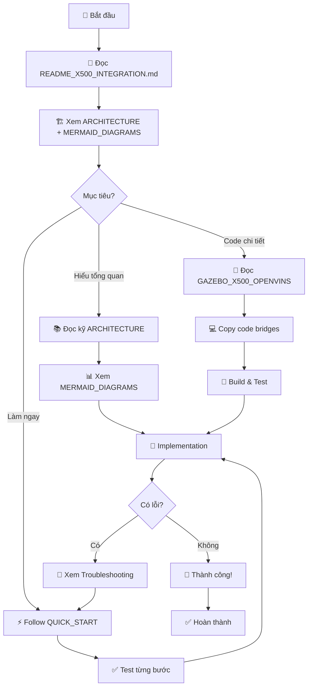

# 📁 Tài liệu Tích hợp Gazebo X500 + OpenVINS

Thư mục này chứa tất cả tài liệu cần thiết để tích hợp drone X500 trong Gazebo với OpenVINS vào hệ thống EGO-Swarm.

---

## 📚 Danh sách Tài liệu

### 1️⃣ **MERMAID_DIAGRAMS.md** 📊 [XEM SƠ ĐỒ]
**Sơ đồ Mermaid Tương tác**

Bao gồm 8 loại sơ đồ chuyên nghiệp:
- ✅ Sơ đồ tổng quan kiến trúc hệ thống
- ✅ Sequence diagrams (Odometry Flow, Control Flow)
- ✅ Perception & Mapping Flow
- ✅ Swarm Communication (Multi-drone)
- ✅ Bridge Nodes chi tiết
- ✅ Topic Mapping Diagram
- ✅ State Machine (Planning FSM)
- ✅ Deployment Comparison (Before/After)
- ✅ Data Flow Timeline

**Cách dùng:**
```bash
# Xem trong VS Code với Mermaid extension
code MERMAID_DIAGRAMS.md

# Hoặc render online
# Copy code Mermaid paste vào: https://mermaid.live/
```

**Đặc điểm:**
- 🎨 Màu sắc theo module
- 📱 Render được trên GitHub
- 🖼️ Export PNG/SVG cho presentations
- ✏️ Dễ chỉnh sửa và customize

---

### 2️⃣ **ARCHITECTURE_X500_INTEGRATION.md** 🏗️ [KIẾN TRÚC]
**Tài liệu Kiến trúc Hệ thống**

Nội dung:
- 📐 Sơ đồ ASCII Art chi tiết
- 🔄 Luồng dữ liệu (Odometry, Control, Perception, Swarm)
- ⚖️ So sánh trước/sau tích hợp
- 📋 Topic Mapping Table
- 📝 File cần tạo/sửa
- 🔧 Dependencies và Testing Checklist

**Khi nào dùng:** Để hiểu tổng quan kiến trúc và luồng dữ liệu

---

### 3️⃣ **GAZEBO_X500_OPENVINS_INTEGRATION.md** 📖 [CHI TIẾT ĐẦY ĐỦ]
**Hướng dẫn Tích hợp Chi tiết**

Nội dung:
- 📊 Phân tích topics mà EGO-Swarm cần
- 🔍 Chuẩn bị X500 Gazebo
- 👁️ Chuẩn bị OpenVINS
- 💻 **Source code đầy đủ** cho 2 bridge nodes:
  - `odom_converter.cpp` (200+ dòng code)
  - `x500_cmd_bridge.cpp` (150+ dòng code)
- 📦 CMakeLists.txt và Package.xml
- 🚀 Launch files mẫu
- 🛠️ Xử lý vấn đề (Depth camera, Frame transformation, Timestamp sync)
- ✅ Quy trình Build và Test
- 🐛 Troubleshooting chi tiết

**Khi nào dùng:** Khi cần implement code thực tế

---

### 4️⃣ **QUICK_START_X500_INTEGRATION.md** ⚡ [THỰC HÀNH NHANH]
**Hướng dẫn Quick Start**

Nội dung:
- ⏱️ Hoàn thành trong 30-45 phút
- 🎯 8 bước rõ ràng từ A-Z
- 📋 Commands sẵn sàng copy-paste
- ✅ Checklist debug chi tiết
- 🔥 Common errors và cách fix ngay
- 🧪 Testing scenarios cụ thể

**Khi nào dùng:** Khi muốn bắt tay vào làm ngay

---

### 5️⃣ **README_X500_INTEGRATION.md** 🏠 [TỔNG QUAN]
**Tài liệu Tổng quan**

Nội dung:
- 🎯 Mục tiêu tích hợp
- 📁 Cấu trúc tài liệu
- 🚀 Quick start summary
- 🔧 Components và dependencies
- 📊 Sơ đồ kiến trúc đơn giản
- 🎓 Quy trình học tập đề xuất (Level 1-4)
- ⚠️ Lưu ý quan trọng
- 🐛 Troubleshooting
- ✅ Testing checklist
- 🎉 Kết quả mong đợi

**Khi nào dùng:** Điểm bắt đầu, hiểu overview toàn bộ dự án

---

## 🗺️ Quy trình Đọc Tài liệu (Đề xuất)



---

## 🎯 Lộ trình Học tập

### 📅 Ngày 1: Hiểu Kiến trúc (2-3 giờ)
1. ✅ Đọc `README_X500_INTEGRATION.md` - Tổng quan
2. ✅ Xem `MERMAID_DIAGRAMS.md` - Hiểu luồng dữ liệu
3. ✅ Đọc `ARCHITECTURE_X500_INTEGRATION.md` - Chi tiết kiến trúc
4. ✅ Vẽ lại sơ đồ theo hiểu biết của bạn (Optional)

### 📅 Ngày 2: Thực hành Cơ bản (3-4 giờ)
1. ✅ Follow `QUICK_START_X500_INTEGRATION.md`
2. ✅ Tạo package `x500_bridge`
3. ✅ Test từng component riêng lẻ
4. ✅ Debug và fix lỗi

### 📅 Ngày 3: Implement Chi tiết (4-5 giờ)
1. ✅ Đọc `GAZEBO_X500_OPENVINS_INTEGRATION.md`
2. ✅ Copy và hiểu code 2 bridge nodes
3. ✅ Customize cho setup của bạn
4. ✅ Test full system với single drone

### 📅 Ngày 4-5: Nâng cao (5-8 giờ)
1. ✅ Test với multiple drones (swarm)
2. ✅ Tune parameters
3. ✅ Add depth camera hoặc configure pcl_render
4. ✅ Performance optimization

### 📅 Tuần 2+: Deploy Thực tế (1-2 tuần)
1. ✅ Thay Gazebo → Hardware X500 thực
2. ✅ Calibrate camera và IMU
3. ✅ Tune OpenVINS cho môi trường thực
4. ✅ Flight test và safety validation

---

## 🔑 Key Concepts

### **Bridge Pattern**
```
Source System → Bridge Node → Target System
```
- Không sửa code core của source/target
- Chỉ convert topics, messages, frames
- Dễ maintain và update

### **Frame Convention**
- **PX4/Gazebo**: NED (North-East-Down)
- **ROS2/EGO-Swarm**: ENU (East-North-Up)
- **Conversion**: X=X, Y=Y, Z=-Z

### **Topic Mapping**
| Source | Bridge | Target |
|--------|--------|--------|
| `/ov_msckf/odometry_imu` | odom_converter | `odom_world` |
| `/drone_X_planning/pos_cmd` | x500_cmd_bridge | `/fmu/in/trajectory_setpoint` |

---

## 📊 Sơ đồ Tổng quan Nhanh

```
┌─────────┐       ┌─────────┐       ┌──────────┐
│ X500    │──────>│OpenVINS │──────>│ odom_    │
│ Gazebo  │       │  (VIO)  │       │converter │
└─────────┘       └─────────┘       └─────┬────┘
     ↑                                     │
     │                                     ↓
     │            ┌──────────────────────────────┐
     │            │    EGO-SWARM PLANNER         │
     │            │  - Sensing                   │
     │            │  - Mapping                   │
     │            │  - Planning                  │
     │            └────────────┬─────────────────┘
     │                         │
┌────┴────┐                   ↓
│   PX4   │<──────────┌──────────────┐
│  SITL   │           │ x500_cmd_    │
└─────────┘           │   bridge     │
                      └──────────────┘
```

---

## 🛠️ Tools & Extensions Đề xuất

### VS Code Extensions:
1. **Markdown Preview Mermaid Support** - Xem Mermaid diagrams
2. **Markdown All in One** - Edit markdown dễ hơn
3. **ROS** - ROS2 syntax highlighting
4. **C/C++** - Code completion

### Online Tools:
1. **Mermaid Live Editor**: <https://mermaid.live/>
2. **Draw.io**: Vẽ diagrams bổ sung
3. **ROS2 Topic Graph**: `ros2 run rqt_graph rqt_graph`

---

## 📞 Support & Debugging

### Khi gặp vấn đề:
1. ✅ Check `QUICK_START` → "Common Errors"
2. ✅ Check `GAZEBO_X500_OPENVINS` → "Troubleshooting"
3. ✅ Verify topics: `ros2 topic list` và `ros2 topic echo`
4. ✅ Check logs: `ros2 run rqt_console rqt_console`
5. ✅ Draw your own diagram để hiểu flow

### Debug Commands:
```bash
# Check topics
ros2 topic list | grep -E "odom|planning|cmd"

# Check frequencies
ros2 topic hz /ov_msckf/odometry_imu
ros2 topic hz odom_world

# Echo messages
ros2 topic echo /drone_0_planning/pos_cmd --once

# Check node connections
ros2 node info odom_converter
ros2 node info x500_cmd_bridge
```

---

## ✅ Quick Checklist

- [ ] Đọc xong README
- [ ] Xem hết Mermaid diagrams
- [ ] Hiểu kiến trúc tổng quan
- [ ] Follow quick start
- [ ] Build được x500_bridge package
- [ ] Test được odom_converter
- [ ] Test được x500_cmd_bridge
- [ ] X500 di chuyển trong Gazebo
- [ ] Planning tránh chướng ngại vật
- [ ] Swarm communication hoạt động

---

## 🎉 Kết quả Cuối cùng

Sau khi hoàn thành, bạn sẽ có:

1. ✅ **Hệ thống simulation thực tế hơn**
   - X500 với PX4 dynamics
   - OpenVINS với VIO noise/drift
   - Planner robust hơn

2. ✅ **Nền tảng sẵn sàng cho hardware**
   - Code tương thích với X500 thực
   - OpenVINS đã được test
   - Dễ dàng deploy

3. ✅ **Kiến thức vững chắc**
   - Hiểu bridge pattern
   - Hiểu frame transformations
   - Hiểu ROS2 topic remapping

---

## 📚 References

- **EGO-Swarm Paper**: <https://arxiv.org/abs/2011.04800>
- **PX4 Docs**: <https://docs.px4.io/>
- **OpenVINS Docs**: <https://docs.openvins.com/>
- **ROS2 Humble**: <https://docs.ros.org/en/humble/>
- **Mermaid Docs**: <https://mermaid.js.org/>

---

**Made with ❤️ for EGO-Swarm integration**

**Version**: 1.0  
**Last Updated**: October 2025  
**Author**: AI Assistant + Your Team
